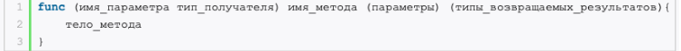

### receiver
collapsed:: true
	- **Получатель** — это параметр того типа, к которому прикрепляется метод.
	- 
- ### deploy
  collapsed:: true
	- это процесс развертывания, установки и запуска программного обеспечения или приложения на целевой системе или сервере, чтобы оно стало доступным для использования конечным пользователям.
	  
	  В контексте разработки программного обеспечения "deploy" обычно означает:
	- **Перенос приложения**:
		- После того как приложение разработано и протестировано локально или на тестовом сервере, процесс deploy включает перенос (или загрузку) приложения на конечное место назначения, такое как хостинг-провайдер, облачная платформа или сервер.
	- **Установка и настройка**:
		- Приложение должно быть установлено на целевой сервер и настроено для корректной работы с учетом конфигурационных параметров и требований окружения.
	- **Запуск и проверка**:
		- После установки и настройки приложение запускается на целевом сервере. После этого проводится ряд проверок, чтобы убедиться, что приложение работает как ожидается и доступно для конечных пользователей.
	- **Мониторинг и обслуживание**:
		- После успешного развертывания приложения необходимо проводить мониторинг его работы и реагировать на любые проблемы или отклонения в его работе. Также могут проводиться регулярные обновления и поддержка приложения.
		  
		  Таким образом, "deploy" является важным этапом в жизненном цикле разработки программного обеспечения, который позволяет превратить разработанный код в полноценное и доступное для использования приложение.
- ### атоманрная операция (atomic operation)
  collapsed:: true
	- Атомарные операции используются в асинхронном программировании для безопасного доступа к разделяемым данным из нескольких потоков или горутин. Они предотвращают гонки данных, потерю данных и неправильные результаты при одновременном доступе к общим ресурсам. В языке Go, например, они часто используются для безопасного обновления глобальных счетчиков, флагов состояния и других разделяемых переменных в асинхронном окружении.
	- в асинхронном программировании, где множество задач выполняется параллельно или конкурентно, атомарные операции могут использоваться для обеспечения безопасности доступа к разделяемым ресурсам.
	- Например, если вы запускаете несколько горутин (goroutines) в языке Go или асинхронные функции в других языках, и они все должны обновлять одну и ту же переменную, такую как счетчик или флаг состояния, в этом случае использование атомарных операций становится крайне важным.
	- Без атомарных операций может произойти гонка данных, что приведет к непредсказуемому поведению вашего приложения. Например, если две горутины одновременно пытаются увеличить значение счетчика, они могут переписывать результаты друг друга, что приведет к потере данных или неправильным результатам.
	- Вот пример на Go, демонстрирующий использование атомарных операций в асинхронных функциях:
		- Теперь давайте перепишем этот пример, используя атомарные операции:
		- ```go
		  package main
		  
		  import (
		  	"fmt"
		  	"sync"
		  	"sync/atomic"
		  )
		  
		  func worker(counter *uint64, wg *sync.WaitGroup) {
		  	// Инкрементируем счетчик атомарно
		  	atomic.AddUint64(counter, 1)
		  	wg.Done()
		  }
		  
		  func main() {
		  	var counter uint64 = 0
		  	var wg sync.WaitGroup
		  
		  	// Создаем 100 горутин
		  	for i := 0; i < 100; i++ {
		  		wg.Add(1)
		  		go worker(&counter, &wg)
		  	}
		  
		  	// Ожидаем завершения всех горутин
		  	wg.Wait()
		  
		  	// Выводим результат
		  	fmt.Println("Counter value:", counter)
		  }
		  ```
		- В этом примере мы используем мьютекс (mutex) для блокировки доступа к общему ресурсу (счетчику) во время его изменения. Это гарантирует, что только одна горутина может изменять значение счетчика в определенный момент времени, предотвращая гонку данных.
		- ```go
		  package main
		  
		  import (
		  	"fmt"
		  	"sync"
		  	"sync/atomic"
		  )
		  
		  var counter uint64
		  
		  func increment() {
		  	atomic.AddUint64(&counter, 1)
		  }
		  
		  func main() {
		  	var wg sync.WaitGroup
		  
		  	for i := 0; i < 100; i++ {
		  		wg.Add(1)
		  		go func() {
		  			defer wg.Done()
		  			increment()
		  		}()
		  	}
		  
		  	wg.Wait()
		  	fmt.Println("Counter value:", counter)
		  }
		  
		  ```
		- Здесь мы используем функцию `atomic.AddUint64` для безопасного инкремента значения счетчика. Это обеспечивает безопасность при изменении счетчика в многопоточной среде, не требуя явного использования мьютекса.
- ###  эвакуация карты (map evacuation)
  collapsed:: true
	- В контексте Go "эвакуация карты" (map evacuation) обычно связана с процессом, который происходит в сборщике мусора (garbage collector) Go.
	- В Go сборщик мусора отслеживает использование памяти и автоматически освобождает память, которая больше не используется. Одним из аспектов работы сборщика мусора является управление памятью, используемой для хранения карт (map) в Go.
	- Эвакуация карты происходит, когда карта нуждается в расширении своей внутренней структуры для поддержки дополнительных элементов. Поскольку карта может содержать переменное количество элементов и должна быть гибкой, чтобы поддерживать их, иногда требуется изменить размер внутренних структур данных карты.
	- Когда карта переполняется, ее внутренняя структура данных может быть перемещена в другое место в памяти, чтобы сделать ее больше. Этот процесс перемещения внутренней структуры называется эвакуацией карты.
	- Эвакуация карты обычно происходит незаметно для программы, и сборщик мусора Go заботится об этом автоматически. Однако это важно понимать, особенно при проектировании производительных приложений на Go, так как эвакуация карты может вызвать задержки в выполнении программы из-за переноса данных в другое место в памяти.
- ### workerpool
- ### семафор
- ### контракт
  collapsed:: true
	- интерфейс с методами
- ### waterfall model
  collapsed:: true
	- модель **«**водопад**» **
- ### ATDD
- ### TDD
- ### DAO (document access object)
  collapsed:: true
	-
- ###  **геттеры и  сеттеры**
  collapsed:: true
	- **геттеры** (от английского get – получать) и **сеттеры** (от английского set – устанавливать). Они представляют собой методы для получения и установки соответственно значений полей класса. Иначе говоря, геттеры и сеттеры являются посредниками между классом и пользователем. Если запрашиваемая операция может быть выполнена без нарушения принципа инкапсуляции, то они её делают, иначе – нет. Это обеспечивает безопасность конфиденциальных данных и предоставляет контролируемый инструмент для работы с ними.
- ### has-a  (Имеет)
  collapsed:: true
	- владение" Has-a отношение в Go обычно реализуется через вложение структур или использование интерфейсов. Это отношение описывает, что одна структура содержит или использует другую структуру. В Go нет строгой модели наследования, поэтому has-a часто используется для достижения подобного поведения.
	- ```go
	  type Engine struct {
	      horsepower int
	  }
	  
	  type Car struct {
	      engine Engine
	  }
	  ```
- ### is-a (Является)
  collapsed:: true
	- Is-a отношение в традиционных ООП языках описывает наследование, где подкласс является экземпляром своего суперкласса. В Go нет классического наследования, поэтому прямого аналога is-a отношения нет. Однако, можно воспользоваться интерфейсами для достижения похожего эффекта.
	- ```go
	  type Vehicle interface {
	      Drive()
	  }
	  
	  type Car struct {}
	  
	  func (c Car) Drive() {
	      fmt.Println("Driving a car")
	  }
	  
	  type Truck struct {}
	  
	  func (t Truck) Drive() {
	      fmt.Println("Driving a truck")
	  }
	  ```
- ### Отличия и использование has-a  & is-a
  collapsed:: true
	- **Has-a** используется для описания отношений "включения" или "состояния", где одна структура использует или содержит другую структуру. Это помогает организовать код и разделить ответственность между различными частями приложения.
	- **Is-a** в Go обычно реализуется через интерфейсы, что позволяет определить общие возможности для группы типов. Это полезно для обеспечения гибкости и расширяемости кода, позволяя легко добавлять новые типы, которые удовлетворяют определенному интерфейсу.
	  
	  Выбор между has-a и is-a зависит от конкретной задачи и архитектуры приложения. В Go, благодаря мощным возможностям интерфейсов, можно достичь большей гибкости и модульности, чем в некоторых других языках с классическим наследованием.
	  
	  Phind Instant[](https://www.phind.com/search?cache=ix6l0th5zxuvba77vnprxsej)
- ### **ad-hoc** (интерфейсный Полиморфизм)
  collapsed:: true
	- Ad-hoc полиморфизм в Go достигается за счет использования интерфейсов. Интерфейсы определяют набор методов, которые должны быть реализованы типом. Когда тип реализует все методы интерфейса, этот тип считается реализующим данный интерфейс. Это позволяет обрабатывать объекты разных типов одинаково, независимо от их внутренней структуры, если они реализуют один и тот же интерфейс.
	- ```go
	  package main
	  
	  import (
	      "fmt"
	  )
	  
	  // Animal интерфейс, который требует реализации метода Speak
	  type Animal interface {
	      Speak() string
	  }
	  
	  // Dog и Cat структуры, реализующие интерфейс Animal
	  type Dog struct{}
	  type Cat struct{}
	  
	  // Реализация метода Speak для Dog
	  func (d Dog) Speak() string {
	      return "Woof!"
	  }
	  
	  // Реализация метода Speak для Cat
	  func (c Cat) Speak() string {
	      return "Meow!"
	  }
	  
	  func main() {
	      var animal Animal
	  
	      dog := Dog{}
	      cat := Cat{}
	  
	      animal = dog
	      fmt.Println(animal.Speak()) // Woof!
	  
	      animal = cat
	      fmt.Println(animal.Speak()) // Meow!
	  }
	  
	  ```
- ### параметрический полиморфизм
  collapsed:: true
	- ### Почему Go не поддерживает параметрическую полиморфию
	  
	  Go не поддерживает параметрическую полиморфию, потому что это требует сложной системы типов, которая бы могла работать с произвольным количеством типов. Вместо этого, Go предпочитает простоту и ясность, что делает его менее гибким в плане обобщенного программирования, но также и более понятным и предсказуемым для разработчиков.
	  
	  Таким образом, ad-hoc полиморфизм в Go достигается через интерфейсы, позволяя объектам разных типов быть обработанными одинаково, если они реализуют определенный интерфейс.
- ### модификаторы
  collapsed:: true
	- Модификаторы в программировании используются для изменения поведения элементов программы, таких как переменные, функции, классы и т.д., влияя на их доступность, область видимости, постоянство и другие аспекты. В зависимости от языка программирования, модификаторы могут выполнять различные функции.
- ### `public`, `private` или `protected`.
  collapsed:: true
	- n. В Go отсутствуют специальные ключевые слова для модификаторов доступа, как `public`, `private` или `protected`. Вместо этого, Go использует соглашение об именовании для определения, какие элементы пакета экспортируются (доступны извне) и какие остаются невидимыми (только доступны внутри пакета).
	- ### Экспортированные и невидимые элементы
	- **Экспортированные элементы** в Go имеют заглавные буквы в начале имени. Это означает, что любой тип, переменная, константа, функция или метод с заглавной буквой в начале будет доступен из других пакетов. Например, `MyFunction` или `PublicVar`.
	- **Невидимые элементы** начинаются со строчной буквы. Эти элементы доступны только внутри пакета, в котором они были объявлены. Например, `myFunction` или `privateVar`.
	- ```go
	  package mypackage
	  
	  // Экспортированная переменная
	  var MyVariable string
	  
	  // Экспортированный тип
	  type MyType struct {
	      Field string
	  }
	  
	  // Экспортированная функция
	  func MyFunction() {
	      // Код функции
	  }
	  
	  // Невидимая переменная
	  var myVariable string
	  
	  // Невидимый тип
	  type myType struct {
	      field string
	  }
	  
	  // Невидимая функция
	  func myFunction() {
	      // Код функции
	  }
	  ```
	- ### Важность экспорта
		- Экспорт элементов в Go позволяет контролировать, какие части вашего кода доступны для использования другими разработчиками. Это помогает поддерживать чистоту API и упрощает внесение изменений в ваш пакет без нарушения кода, который зависит от него. Правильное использование экспорта элементов является ключевым аспектом проектирования пакетов в Go, обеспечивая легкость чтения и поддержки кода [1](https://www.linkedin.com/pulse/oop-principles-golang-shariful-islam#:~:text=Golang%20does%20not%20have%20access,unexported%20and%20Uppercase%20means%20Exported.)[2](https://www.digitalocean.com/community/tutorials/understanding-package-visibility-in-go)[3](https://stackoverflow.com/questions/20850047/public-private-upper-case-lower-case)[4](https://www.apimatic.io/blog/2023/04/how-gos-simplicity-brings-complexity).
- ### Функциональные опции
  collapsed:: true
	-
- ### Вычисляем контрольную сумму CRC64
  collapsed:: true
	- В Go (Golang) CRC64 реализуется с помощью стандартной библиотеки `hash/crc64`. Вот пример использования CRC64 в Go:
	- **Импорт библиотеки:**
	  
	  ```go
	  import (
	    "hash/crc64"
	    "fmt"
	  )
	  ```
	- **Создание таблицы полиномов:**
	  Go предоставляет предопределенные полиномы CRC64, такие как `crc64.ISO` и `crc64.ECMA`. Сначала нужно создать таблицу для выбранного полинома.
	  
	  ```go
	  func main() {
	    table := crc64.MakeTable(crc64.ECMA)
	  }
	  ```
	- **Вычесление CRC64 хэша:**
	  Используйте созданную таблицу для вычисления CRC64 хэша данных.
	  
	  ```go
	  func main() {
	    table := crc64.MakeTable(crc64.ECMA)
	    data := []byte("Hello, World!")
	    checksum := crc64.Checksum(data, table)
	    fmt.Printf("CRC64 checksum: %x\n", checksum)
	  }
	  ```
	  
	  Полный пример:
	  
	  ```go
	  package main
	  
	  import (
	    "hash/crc64"
	    "fmt"
	  )
	  
	  func main() {
	    // Создаем таблицу для полинома ECMA
	    table := crc64.MakeTable(crc64.ECMA)
	  
	    // Данные для вычисления контрольной суммы
	    data := []byte("Hello, World!")
	  
	    // Вычисляем контрольную сумму CRC64
	    checksum := crc64.Checksum(data, table)
	  
	    // Выводим результат
	    fmt.Printf("CRC64 checksum: %x\n", checksum)
	  }
	  ```
	  
	  Этот пример:
	- Импортирует необходимые пакеты.
	- Создает таблицу для полинома CRC64 ECMA.
	- Вычисляет контрольную сумму для строки "Hello, World!".
	- Выводит полученную контрольную сумму в шестнадцатеричном формате.
	  
	  **"Вычисляем контрольную сумму CRC64"** можно понять так:
	  
	  Представь, что у тебя есть набор данных, например, текстовая строка "Hello, World!". Мы хотим убедиться, что этот текст не изменился, если его кто-то передаст или сохранит где-то. Для этого мы используем специальный метод под названием CRC64.
	- **Набор данных**: Это может быть любой текст или информация, например, "Hello, World!".
	- **Математическая формула (CRC64)**: Это как рецепт, который преобразует твой текст в особое число. Это число — как уникальная подпись твоего текста.
	- **Вычисляем**: Мы применяем этот рецепт (формулу) к нашему тексту и получаем число. Это и есть "контрольная сумма".
	- **Проверка целостности**: Если кто-то изменит твой текст, и мы снова применим этот рецепт, то получим другое число. Таким образом, мы можем понять, что текст был изменён.
	  
	  Пример:
	- У нас есть текст "Hello, World!".
	- Мы применяем рецепт CRC64 и получаем число, скажем, 12345678.
	- Теперь каждый раз, когда мы хотим проверить, что текст не изменился, мы снова применяем рецепт.
	- Если число всё ещё 12345678, значит текст тот же. Если число другое, значит текст изменился.
	  
	  Надеюсь, так понятнее!
- ### [Буффер и кеш](https://ru.wikipedia.org/wiki/%D0%91%D1%83%D1%84%D0%B5%D1%80_(%D0%B8%D0%BD%D1%84%D0%BE%D1%80%D0%BC%D0%B0%D1%82%D0%B8%D0%BA%D0%B0))